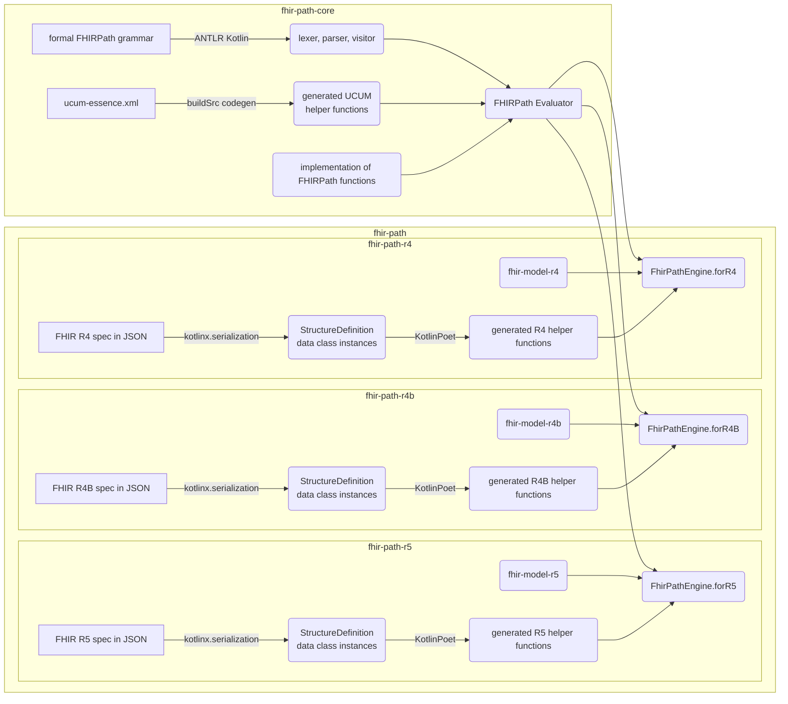

# Kotlin FHIRPath

[](https://github.com/ohs-foundation/kotlin-fhirpath/actions/workflows/run-tests.yml)
[](https://central.sonatype.com/artifact/dev.ohs.fhir/fhir-path-core)
[](https://central.sonatype.com/artifact/dev.ohs.fhir/fhir-path-r4)
[](https://central.sonatype.com/artifact/dev.ohs.fhir/fhir-path-r4b)
[](https://central.sonatype.com/artifact/dev.ohs.fhir/fhir-path-r5)
[](https://central.sonatype.com/artifact/dev.ohs.fhir/fhir-path)
[](https://opensource.org/licenses/Apache-2.0)

Kotlin FHIRPath is an implementation of [HL7® FHIR®](https://www.hl7.org/fhir/overview.html)'s
[FHIRPath](https://hl7.org/fhirpath/N1/) on
[Kotlin Multiplatform](https://kotlinlang.org/docs/multiplatform.html).

## Key features

* Strict conformation to the FHIRPath specification, with predictable and
  [well-documented](#conformance) behavior
* Built with an [ANTLR](https://www.antlr.org/)-generated parser for adherence to the formal grammar
* Support for validation, conversion, and comparison between compatible
  [UCUM](http://unitsofmeasure.org/ucum.html) units
* Multiplatform support across Android, iOS, Desktop (JVM), Server-side (JVM), and Web (Wasm/JS)
* Support for FHIR R4, R4B, R5, and future versions
* Tested against the official [FHIR test cases](https://github.com/FHIR/fhir-test-cases) to
  guarantee correctness

## FHIRPath version support

The implementation is based on the [FHIRPath Normative Release](https://hl7.org/fhirpath/N1/).
However, we also incorporate some of the latest features and clarifications from the
[Continuous Build](https://build.fhir.org/ig/HL7/FHIRPath/) wherever feasible. Please note the
experimental nature of the sections marked as STU (Standard for Trial Use) in the Continuous Build.

## FHIR version support

The library supports FHIR R4, R4B and R5. Support will be added for future FHIR versions.

## Supported platforms

The library supports the following
[target platforms](https://kotlinlang.org/docs/multiplatform-dsl-reference.html#targets):

| Target platform                    | Gradle target | Artifact suffix | Support |
|:-----------------------------------|:--------------|:----------------|:--------|
| Kotlin/JVM                         | `jvm`         | `-jvm`          | ✅       |
| Kotlin/Wasm                        | `wasmJs`      | `-wasm-js`      | ✅       |
| Kotlin/Wasm                        | `wasmWasi`    | `-wasm-wasi`    | ✅       |
| Kotlin/JS                          | `js`          | `-js`           | ✅       |
| Android applications and libraries | `android`     | `-android`      | ✅       |

The library also supports the following
[Kotlin/Native targets](https://kotlinlang.org/docs/native-target-support.html):

| Gradle target     | Artifact suffix      | Tier | Support |
|:------------------|:---------------------|:-----|:--------|
| iosSimulatorArm64 | `-iossimulatorarm64` | 1    | ✅       |
| iosArm64          | `-iosarm64`          | 1    | ✅       |

<details>
<summary><b>View Target Platform Artifact Matrix</b></summary>
<br/>

Each library artifact is published with platform-specific variants. The table below shows the Maven
Central release status for every artifact–platform combination:

| Platform          | `fhir-path-core`                                                                                                                                                                                                                                                                               | `fhir-path-r4`                                                                                                                                                                                                                                                                        | `fhir-path-r4b`                                                                                                                                                                                                                                                                            | `fhir-path-r5`                                                                                                                                                                                                                                                                         | `fhir-path`<br/>(R4 + R4B + R5)                                                                                                                                                                                                                                          |
|:------------------|:-----------------------------------------------------------------------------------------------------------------------------------------------------------------------------------------------------------------------------------------------------------------------------------------------|:--------------------------------------------------------------------------------------------------------------------------------------------------------------------------------------------------------------------------------------------------------------------------------------|:-------------------------------------------------------------------------------------------------------------------------------------------------------------------------------------------------------------------------------------------------------------------------------------------|:---------------------------------------------------------------------------------------------------------------------------------------------------------------------------------------------------------------------------------------------------------------------------------------|:-------------------------------------------------------------------------------------------------------------------------------------------------------------------------------------------------------------------------------------------------------------------------|
| **Root (KMP)**    | [](https://central.sonatype.com/artifact/dev.ohs.fhir/fhir-path-core)                                                                         | [](https://central.sonatype.com/artifact/dev.ohs.fhir/fhir-path-r4)                                                                         | [](https://central.sonatype.com/artifact/dev.ohs.fhir/fhir-path-r4b)                                                                         | [](https://central.sonatype.com/artifact/dev.ohs.fhir/fhir-path-r5)                                                                         | [](https://central.sonatype.com/artifact/dev.ohs.fhir/fhir-path)                                                                         |
| **JVM**           | [](https://central.sonatype.com/artifact/dev.ohs.fhir/fhir-path-core-jvm)                                                         | [](https://central.sonatype.com/artifact/dev.ohs.fhir/fhir-path-r4-jvm)                                                         | [](https://central.sonatype.com/artifact/dev.ohs.fhir/fhir-path-r4b-jvm)                                                         | [](https://central.sonatype.com/artifact/dev.ohs.fhir/fhir-path-r5-jvm)                                                         | [](https://central.sonatype.com/artifact/dev.ohs.fhir/fhir-path-jvm)                                                         |
| **Wasm-JS**       | [](https://central.sonatype.com/artifact/dev.ohs.fhir/fhir-path-core-wasm-js)                                         | [](https://central.sonatype.com/artifact/dev.ohs.fhir/fhir-path-r4-wasm-js)                                         | [](https://central.sonatype.com/artifact/dev.ohs.fhir/fhir-path-r4b-wasm-js)                                         | [](https://central.sonatype.com/artifact/dev.ohs.fhir/fhir-path-r5-wasm-js)                                         | [](https://central.sonatype.com/artifact/dev.ohs.fhir/fhir-path-wasm-js)                                         |
| **Wasm-Wasi**     | [](https://central.sonatype.com/artifact/dev.ohs.fhir/fhir-path-core-wasm-wasi)                                 | [](https://central.sonatype.com/artifact/dev.ohs.fhir/fhir-path-r4-wasm-wasi)                                 | [](https://central.sonatype.com/artifact/dev.ohs.fhir/fhir-path-r4b-wasm-wasi)                                 | [](https://central.sonatype.com/artifact/dev.ohs.fhir/fhir-path-r5-wasm-wasi)                                 | [](https://central.sonatype.com/artifact/dev.ohs.fhir/fhir-path-wasm-wasi)                                 |
| **JS**            | [](https://central.sonatype.com/artifact/dev.ohs.fhir/fhir-path-core-js)                                                             | [](https://central.sonatype.com/artifact/dev.ohs.fhir/fhir-path-r4-js)                                                             | [](https://central.sonatype.com/artifact/dev.ohs.fhir/fhir-path-r4b-js)                                                             | [](https://central.sonatype.com/artifact/dev.ohs.fhir/fhir-path-r5-js)                                                             | [](https://central.sonatype.com/artifact/dev.ohs.fhir/fhir-path-js)                                                             |
| **Android**       | [](https://central.sonatype.com/artifact/dev.ohs.fhir/fhir-path-core-android)                                         | [](https://central.sonatype.com/artifact/dev.ohs.fhir/fhir-path-r4-android)                                         | [](https://central.sonatype.com/artifact/dev.ohs.fhir/fhir-path-r4b-android)                                         | [](https://central.sonatype.com/artifact/dev.ohs.fhir/fhir-path-r5-android)                                         | [](https://central.sonatype.com/artifact/dev.ohs.fhir/fhir-path-android)                                         |
| **iOS Simulator** | [](https://central.sonatype.com/artifact/dev.ohs.fhir/fhir-path-core-iossimulatorarm64) | [](https://central.sonatype.com/artifact/dev.ohs.fhir/fhir-path-r4-iossimulatorarm64) | [](https://central.sonatype.com/artifact/dev.ohs.fhir/fhir-path-r4b-iossimulatorarm64) | [](https://central.sonatype.com/artifact/dev.ohs.fhir/fhir-path-r5-iossimulatorarm64) | [](https://central.sonatype.com/artifact/dev.ohs.fhir/fhir-path-iossimulatorarm64) |
| **iOS Device**    | [](https://central.sonatype.com/artifact/dev.ohs.fhir/fhir-path-core-iosarm64)                                     | [](https://central.sonatype.com/artifact/dev.ohs.fhir/fhir-path-r4-iosarm64)                                     | [](https://central.sonatype.com/artifact/dev.ohs.fhir/fhir-path-r4b-iosarm64)                                     | [](https://central.sonatype.com/artifact/dev.ohs.fhir/fhir-path-r5-iosarm64)                                     | [](https://central.sonatype.com/artifact/dev.ohs.fhir/fhir-path-iosarm64)                                     |

</details>

## Implementation

This project uses [ANTLR Kotlin](https://github.com/Strumenta/antlr-kotlin) to generate the
lexer, parser and visitor directly from the formal FHIRPath grammar. This automated approach ensures
correctness, improves maintainability, and significantly reduces development time.

The
[FHIRPath Evaluator](fhirpath/src/commonMain/kotlin/dev.ohs.fhir/fhirpath/FhirPathEvaluator.kt)
implements the visitor class generated by ANTLR, evaluating FHIRPath expressions by traversing the
in-memory data model from the [Kotlin FHIR](https://github.com/ohs-foundation/kotlin-fhir) library.

A key requirement for FHIRPath evaluation is the capability to access data elements by name. To
achieve this with cross-platform compatibility (avoiding reflection), a codegen embedded in
`buildSrc` generates helper functions to the Kotlin FHIR data model.


```mermaid
graph LR
    subgraph fhir-path-core
        GRAMMAR[formal FHIRPath grammar] -- ANTLR Kotlin --> VISITOR(lexer, parser, visitor)
        VISITOR --> EV(FHIRPath Evaluator)

        UE[ucum-essence.xml] -- buildSrc codegen --> UH(generated UCUM<br>helper functions)
        UH --> EV

        IMPL(implementation of FHIRPath functions) --> EV
    end

    subgraph fhir-path
      subgraph fhir-path-r5
          EV --> FPE5(FhirPathEngine.forR5)
          
          FM5(fhir-model-r5) --> FPE5

          SPEC5[FHIR R5 spec in JSON] -- kotlinx.serialization --> SD5(StructureDefinition<br>data class instances)
          SD5 -- KotlinPoet --> H5(generated R5 helper functions)
          H5 --> FPE5
      end
  
      subgraph fhir-path-r4b
          EV --> FPE4B(FhirPathEngine.forR4B)

          FM4B(fhir-model-r4b) --> FPE4B

          SPEC4B[FHIR R4B spec in JSON] -- kotlinx.serialization --> SD4B(StructureDefinition<br>data class instances)
          SD4B -- KotlinPoet --> H4B(generated R4B helper functions)
          H4B --> FPE4B
      end

      subgraph fhir-path-r4
          EV --> FPE4(FhirPathEngine.forR4)

          FM4(fhir-model-r4) --> FPE4

          SPEC4[FHIR R4 spec in JSON] -- kotlinx.serialization --> SD4(StructureDefinition<br>data class instances)
          SD4 -- KotlinPoet --> H4(generated R4 helper functions)
          H4 --> FPE4
      end
    end
```

*Figure 1: Architecture diagram*

The following table lists the chosen internal types for the FHIRPath primitive types.

| FHIRPath type  | Internal type  |
|-----------------------------------------------------------------------------|-------------------------------------------------------------------------------|
| Boolean                                                                     | kotlin.Boolean                                                                |
| String                                                                      | kotlin.String                                                                 |
| Integer                                                                     | kotlin.Int                                                                    |
| Long                                                                        | kotlin.Long                                                                   |
| Decimal                                                                     | com.ionspin.kotlin.bignum.decimal.BigDecimal                                  |
| Date                                                                        | FhirPathDate                                                                  |
| DateTime                                                                    | FhirPathDateTime                                                              |
| Time                                                                        | FhirPathTime                                                                  |
| Quantity                                                                    | FhirPathQuantity                                                              |

This project defines Date, DateTime, Time, and Quantity classes in order to implement the FHIRPath
specification across different FHIR versions. In particular, DateTime and Time in FHIRPath may
include partial time (e.g. missing minutes and seconds), which is not allowed in FHIR. Therefore,
new implementations are needed.

### Timezone offset in date time values

This FHIRPath implementation adopts a strict, safety-first approach to date time comparisons,
especially around the handling of timezones and date time values with different precisions.

#### Date time values without timezone offset

The FHIRPath specification allows implementations to provide a default timezone offset for date time
values that do not have one. See the relevant sections on
[equality](https://hl7.org/fhirpath/N1/#datetime-equality),
[equivalence](https://hl7.org/fhirpath/N1/#datetime-equivalence), and
[comparison](https://hl7.org/fhirpath/N1/#comparison).

To prioritize safety and correctness, when comparing date time values without a timezone offset with
date time values with a timezone offset, this implementation **does not assume a default timezone
offset** (such as UTC or the system's timezone offset). This is because the data could have
originated from a different system or context unknown to this implementation, making any "guess"
potentially incorrect and unsafe.

This leads to the following behavior:
- Equality (`=`, `!=`) and comparison (`<=`, `<`, `>`, `>=`) operators will return an empty result
`{}` to indicate uncertainty
- Equivalence (`~`) operator will return `false` since equivalence cannot be proven. Likewise, `!~`
will return `true`.

```
@2025-01-01T00:00:00.0+00:00 = @2025-01-01T00:00:00.0  // returns {} 
@2025-01-01T00:00:00.0+00:00 ~ @2025-01-01T00:00:00.0  // returns false
@2025-01-01T00:00:00.0+00:00 > @2025-01-01T00:00:00.0  // returns {}
```

> [!NOTE]
> While comparing two date time values without timezone offset, the implementation will
> treat them as if they had the same timezone offset. This compromise is made so that local date
> time values can be compared:
>
> ```
> @2025-01-01T00:00:00.0 = @2025-01-01T00:00:00.0`  // returns true
> ```

#### Date time values with timezone offsets but different precisions

According to the specification, two date time values should be compared at each precision, starting
from years all the way to seconds. However, this becomes problematic when the date time values at
hourly precision have half-hour or quarter-hour timezone offsets. Consider `@2025-01-01T00+05:30`
and `@2025-01-01T00+05:45`. In no timezone can both values still be represented as partial date time
values at the same precision in order to carry out the comparison algorithm.

Whilst it is possible to implement
[precision based timing in CQL](https://cql.hl7.org/05-languagesemantics.html#precision-based-timing)
using intervals, it is not part of the FHIRPath specification. For simplicity, this implementation
**returns an empty result for comparing partial date time values with timezone offsets**.

```
// Indian Standard Time (IST) and Nepal Time (NPT)
@2025-01-01T00+05:30 = @2025-01-01T00+05:45   // returns {}
```

### Date/Time precision

This library supports the following precision values for date/time types:

* **Date**: `4` (year), `6` (month), and `8` (day).
* **DateTime**: `4` (year), `6` (month), `8` (day), `10` (hour), `12` (minute), `14` (second), and
  any integer `> 14` (fractional seconds with `precision - 14` decimal places, e.g., `15` for 1
  decimal place, `16` for 2 decimal places, or `17` for millisecond precision).
* **Time**: `2` (hour), `4` (minute), `6` (second), and any integer `> 6` (similarly, fractional
  seconds with `precision - 6` decimal places, e.g., `7` for 1 decimal place, `8` for 2 decimal
  places, or `9` for millisecond precision).

These values are returned by the
[`precision()`](https://build.fhir.org/ig/HL7/FHIRPath/en/#precision--integer) function. They are
also accepted as inputs to functions that take an optional precision parameter, such as
[`lowBoundary()`](https://build.fhir.org/ig/HL7/FHIRPath/en/#lowboundaryprecision-integer-decimal-date-datetime-time)
or [`highBoundary()`](https://build.fhir.org/ig/HL7/FHIRPath/en/#highboundaryprecision-integer-decimal-date-datetime-time).
When a `precision` parameter $N$ is supplied, `lowBoundary(N)` and `highBoundary(N)` compute the lowest
or highest boundary value of the input's uncertainty interval, rounding and formatting the result to $N$
decimal places (for Decimals) or to the target date/time precision $N$.

Any other values are invalid precision values and will throw an error if passed to such functions.

> [!NOTE]
> The FHIRPath specification treats second and sub-second precisions as a single `SECOND` precision
> for [equality](https://hl7.org/fhirpath/N1/#datetime-equality) (`=`, `!=`),
> [equivalence](https://hl7.org/fhirpath/N1/#datetime-equivalence) (`~`, `!~`), and
> [comparison](https://hl7.org/fhirpath/N1/#comparison) (`<`, `<=`, `>`, `>=`), using decimal
> comparison semantics for fractional seconds.

### Error handling

The FHIRPath specification
[does not specify](https://hl7.org/fhirpath/N1/#type-safety-and-strict-evaluation) the desired
behavior when type checking errors occur, allowing the implementation to adopt a strict (e.g. throws
an exception) or a lenient (e.g. returns an empty collection) approach. However, the
[official test suite](https://github.com/FHIR/fhir-test-cases) include test cases that require
lenient type checking. To accommodate such cases, this implementation returns an empty collection
when the FHIRPath expression attempts to access a data element that does not exist.

## Conformance

Test failures against the official [FHIR test cases](https://github.com/FHIR/fhir-test-cases) are
documented in the table below.

|             Test case              |     Root cause     | STU |                  Tracking issue / PR                   |                                                                                                  Note                                                                                                  |
|------------------------------------|--------------------|-----|--------------------------------------------------------|--------------------------------------------------------------------------------------------------------------------------------------------------------------------------------------------------------|
| `testPolymorphismAsB`              | Test               |     | To be raised                                           | No error should be thrown according to [specification](https://hl7.org/fhirpath/#as-type-specifier).                                                                                                   |
| `testDateTimeGreaterThanDate1`     | Implementation     |     |                                                        | Comparison of two date time values, one with a timezone offset one without; see [Date time values without timezone offset](#date-time-values-without-timezone-offset)                                  |
| `testQuantity4`                    | Test               |     | [PR](https://github.com/FHIR/fhir-test-cases/pull/243) |                                                                                                                                                                                                        |
| `testSubSetOf3`                    | Specification/Test |     |                                                        | The test resource is invalid and missing (https://github.com/FHIR/fhir-test-cases/issues/247); the scope of "$this" is unclear (https://jira.hl7.org/browse/FHIR-44601)                                |
| `testIif11`                        | Implementation     |     |                                                        | https://jira.hl7.org/browse/FHIR-44774; https://jira.hl7.org/browse/FHIR-44601                                                                                                                         |
| `testEscape*`                      | Implementation     | STU |                                                        | Function `escape` is not implemented.                                                                                                                                                                  |
| `testUnescape*`                    | Implementation     | STU |                                                        | Function `unescape` is not implemented.                                                                                                                                                                |
| `testNow1`                         | Specification/Test |     |                                                        | As `testDateTimeGreaterThanDate1`.                                                                                                                                                                     |
| `testSort8`                        | Specification/Test |     |                                                        | Test uses `-$this` for descending string sort, but spec uses `asc`/`desc`, https://github.com/FHIR/fhir-test-cases/issues/253.                                                                         |
| `testSort10`                       | Specification/Test |     |                                                        | Test uses `-` prefix for descending sort, but spec uses `asc`/`desc`, https://github.com/FHIR/fhir-test-cases/issues/253.                                                                              |
| `testPlusDate13`                   | Specification/Test |     |                                                        | https://chat.fhir.org/#narrow/channel/179266-fhirpath/topic/Definite.20durations.20above.20seconds.20in.20date.20time.20arithmetic/with/564095766                                                      |
| `testPlusDate15`                   | Specification/Test |     |                                                        | As above.                                                                                                                                                                                              |
| `testPlusDate18`                   | Implementation     |     |                                                        | To be fixed together with `testPlusDate13`, `testPlusDate15`, `testPlusDate21`, `testPlusDate22` for a consistent implementation.                                                                      |
| `testPlusDate19`                   | Implementation     |     |                                                        | To be fixed together with `testPlusDate13`, `testPlusDate15`, `testPlusDate21`, `testPlusDate22` for a consistent implementation.                                                                      |
| `testPlusDate20`                   | Implementation     |     |                                                        | To be fixed together with `testPlusDate13`, `testPlusDate15`, `testPlusDate21`, `testPlusDate22` for a consistent implementation.                                                                      |
| `testPlusDate21`                   | Specification/Test |     |                                                        | As `testPlusDate13`.                                                                                                                                                                                   |
| `testPlusDate22`                   | Specification/Test |     |                                                        | As `testPlusDate13`.                                                                                                                                                                                   |
| `testMinus5`                       | Specification/Test |     |                                                        | As `testPlusDate13`.                                                                                                                                                                                   |
| `testVariables*`                   | Implementation     |     |                                                        | Variables are not implemented.                                                                                                                                                                         |
| `testType1`                        | Implementation     |     |                                                        | Function `type` is not implemented.                                                                                                                                                                    |
| `testType1a`                       | Implementation     |     |                                                        | As above.                                                                                                                                                                                              |
| `testType2`                        | Implementation     |     |                                                        | As above.                                                                                                                                                                                              |
| `testType2a`                       | Implementation     |     |                                                        | As above.                                                                                                                                                                                              |
| `testType3`                        | Implementation     |     |                                                        | As above.                                                                                                                                                                                              |
| `testType4`                        | Implementation     |     |                                                        | As above.                                                                                                                                                                                              |
| `testType9`                        | Implementation     |     |                                                        | As above.                                                                                                                                                                                              |
| `testType10`                       | Implementation     |     |                                                        | As above.                                                                                                                                                                                              |
| `testType15`                       | Implementation     |     |                                                        | As above.                                                                                                                                                                                              |
| `testType16`                       | Implementation     |     |                                                        | As above.                                                                                                                                                                                              |
| `testType20`                       | Implementation     |     |                                                        | Function `type` is not implemented; the `ofType` part of the expression works.                                                                                                                         |
| `testType21`                       | Implementation     |     |                                                        | As `testType20`.                                                                                                                                                                                       |
| `testType22`                       | Implementation     |     |                                                        | `is` with an unknown `System` type should evaluate to false, but the type resolver throws.                                                                                                             |
| `testType23`                       | Implementation     |     |                                                        | As `testType20`.                                                                                                                                                                                       |
| `testTypeA*`                       | Implementation     |     |                                                        | Evaluating `Parameters.parameter[x].value` crashes with `NoSuchElementException`.                                                                                                                      |
| `testConformsTo*`                  | Implementation     |     |                                                        | Function `conformsTo` is not implemented.                                                                                                                                                              |
| `LowBoundaryDateTimeMillisecond1`  | Specification/Test |     |                                                        | Diverges from FHIRPath specification. See [Discussion](https://chat.fhir.org/#narrow/channel/179266-fhirpath/topic/lowBoundary.20and.20highBoundary.20with.20incomplete.20date.20time/with/611113639). |
| `HighBoundaryDateTimeMillisecond1` | Specification/Test |     | As above.                                              | As above.                                                                                                                                                                                              |
| `HighBoundaryDateTimeMillisecond3` | Specification/Test |     | As above.                                              | As above.                                                                                                                                                                                              |
| `Comparable*`                      | Implementation     |     |                                                        | Function `comparable` is not implemented.                                                                                                                                                              |
| `testIndex`                        | Implementation     |     |                                                        | `$index` is not implemented.                                                                                                                                                                           |
| `testPeriodInvariantOld`           | Implementation     |     |                                                        | Function `hasValue` is not implemented.                                                                                                                                                                |
| `testPeriodInvariantNew`           | Implementation     |     |                                                        | Function `lowBoundary` and function `highBoundary` are not implemented.                                                                                                                                |
| `testFHIRPathIsFunction2`          | Implementation     |     |                                                        | `code` specializes `string` in FHIR, but type checks use exact equality with no subtype semantics.                                                                                                     |
| `testFHIRPathIsFunction8`          | Test               |     |                                                        | The vendored `observation-example` input is missing the `patient-age` extension these tests query; it exists upstream in fhir-test-cases.                                                              |
| `testFHIRPathIsFunction9`          | Test               |     |                                                        | As above. Once the input is updated, this test also needs subtype-aware `is` (`Age` specializes `Quantity`).                                                                                           |
| `testFHIRPathIsFunction10`         | Test               |     |                                                        | As above.                                                                                                                                                                                              |
| `testContainedId`                  | Implementation     |     |                                                        |                                                                                                                                                                                                        |
| `testCombine2`                     | Implementation     |     |                                                        | FHIR String and Kotlin String comparison issue in `exclude()` function.                                                                                                                                |
| `testCombine3`                     | Implementation     |     |                                                        | As above.                                                                                                                                                                                              |
| `testPrimitiveExtensions`          | Implementation     |     |                                                        | Function `hasValue` is not implemented.                                                                                                                                                                |

The root cause column documents if the test failure is caused by implementation issues in this
repository, if the test cases themselves are problematic, or it is believed that the specification
itself is ambiguous or inconsistent. For issues in the test cases and the specification, discussions
and proposals should be linked in the table above.

## User Guide

### Adding the library dependency to your project

To use Kotlin FHIRPath, add it to the dependencies in your project. To do that, first make sure to
include the `mavenCentral()`[^1] repository in the `build.gradle.kts` file in your project root.

```
// build.gradle.kts
repositories {
    // Other repositories such as gradlePluginPortal() and google()
    mavenCentral()
}
```

[^1]: Early versions of this library (up to `1.0.0-beta01`) were published under the group ID
`com.google.fhir` on [Google Maven](https://maven.google.com/web/index.html?q=fhir-path).

Then pick the right artifact along two axes:

1. **FHIR version** — depend on only the version(s) you need: `fhir-path-r4`, `fhir-path-r4b`,
   `fhir-path-r5`, or `fhir-path` for all supported versions.
2. **Target platform** — choose the setup that matches your project type (see sections below).

#### Kotlin Multiplatform Projects

For Kotlin Multiplatform projects, add the dependency to the shared `commonMain` source set within
the `kotlin` block of the module's `build.gradle.kts` file (e.g., `composeApp/build.gradle.kts` or
`shared/build.gradle.kts`). This makes the library available across all platforms in your project.

```kotlin
// e.g., composeApp/build.gradle.kts or shared/build.gradle.kts
kotlin {
    sourceSets {
        commonMain.dependencies {
            // Use only the FHIR version(s) you need:
            implementation("dev.ohs.fhir:fhir-path-r4:1.0.0-beta04")

            // Or include all versions at once:
            // implementation("dev.ohs.fhir:fhir-path:1.0.0-beta04")
        }
    }
}
```

#### Android projects

For Android projects, add the dependency to the `dependencies` block in the module's
`build.gradle.kts` file (e.g., `app/build.gradle.kts`).

```kotlin
// e.g., app/build.gradle.kts
dependencies {
    // Use only the FHIR version(s) you need:
    implementation("dev.ohs.fhir:fhir-path-r4:1.0.0-beta04")

    // Or include all versions at once:
    // implementation("dev.ohs.fhir:fhir-path:1.0.0-beta04")
}
```

### Evaluating FHIRPath expressions

To evaluate a FHIRPath expression, create a `FhirPathEngine` for the FHIR version you are working
with and use the `evaluateExpression` function. Here is an example targeting FHIR R4:

```kotlin
import dev.ohs.fhir.fhirpath.FhirPathEngine
import dev.ohs.fhir.model.r4.Patient
import kotlinx.serialization.json.Json

val patientExampleJson = ... // Load "patient-example.json"
val json = Json { ignoreUnknownKeys = true }
val patient = json.decodeFromString<Patient>(patientExampleJson)

// Create the R4 evaluator engine
val fhirPathEngine = FhirPathEngine.forR4()

// Evaluate expressions
val results = fhirPathEngine.evaluateExpression("name.given", patient)
// ["Peter", "James", "Jim", "Peter", "James"]
```

## Developer Guide

### ANTLR

To generate the lexer, parser, and visitor locally using ANTLR Kotlin:

```shell
./gradlew :fhir-path-core:generateKotlinGrammarSource
```

The generated code will be placed in `fhir-path-core/build/generated/grammar` under package
`dev.ohs.fhir.fhirpath.parsers`.

### UCUM helpers

To generate UCUM helpers:

```shell
./gradlew :fhir-path-core:generateUcumHelpers
```

The generated code will be located in `fhir-path-core/build/generated/ucum` under package
`dev.ohs.fhir.fhirpath.ucum`.

### Model extensions

To generate FHIR version specific model extensions:

```shell
./gradlew :fhir-path-r4:generateR4Helpers
./gradlew :fhir-path-r4b:generateR4BHelpers
./gradlew :fhir-path-r5:generateR5Helpers
```

The generated code will be located in `fhir-path-<version>/build/generated` under packages
`dev.ohs.fhir.model.<FHIR_VERSION>.ext` and `dev.ohs.fhir.fhirpath`.

### Tests

This project distinguishes between two types of tests:

* **Spec-based tests**: Driven by
  [FhirPathEngineTest.kt](fhir-path/src/commonTest/kotlin/dev/ohs/fhir/fhirpath/FhirPathEngineTest.kt),
  these load the official [test cases](https://github.com/FHIR/fhir-test-cases) from
  [third_party/fhir-test-cases/](third_party/fhir-test-cases/). As they require local file access,
  they only run on **JVM** and **Android** targets. On other platform targets, file loading is
  stubbed out.
* **Unit tests**: Located in
  [fhir-path/src/commonTest/kotlin/dev/ohs/fhir/fhirpath/](fhir-path/src/commonTest/kotlin/dev/ohs/fhir/fhirpath/),
  these verify specific, platform-agnostic behaviors and run across all targets:
  * [AggregateTest.kt](fhir-path/src/commonTest/kotlin/dev/ohs/fhir/fhirpath/AggregateTest.kt):
    Tests nested aggregates.
  * [EnvironmentVariablesTest.kt](fhir-path/src/commonTest/kotlin/dev/ohs/fhir/fhirpath/EnvironmentVariablesTest.kt):
    Tests user-defined external variables.
  * [TraceTest.kt](fhir-path/src/commonTest/kotlin/dev/ohs/fhir/fhirpath/TraceTest.kt): Verifies the
    logging output of the `trace()` function.

#### Platform coverage and CI

The [CI pipeline](.github/workflows/run-tests.yml) runs tests across six platform targets on every
push and pull request. To run these tests locally, execute the corresponding Gradle task prefixed
with `:fhir-path:` (e.g., `./gradlew :fhir-path:jvmTest`).

| Platform              | Gradle task             | CI runner       | Spec-based tests | Unit tests |
|:----------------------|:------------------------|:----------------|:----------------:|:----------:|
| **JVM**               | `jvmTest`               | `ubuntu-latest` |        ✅         |     ✅      |
| **Android**           | `testDebugUnitTest`     | `ubuntu-latest` |        ✅         |     ✅      |
| **Wasm JS (Browser)** | `wasmJsBrowserTest`     | `ubuntu-latest` |        —         |     ✅      |
| **Wasm WASI (Node)**  | `wasmWasiNodeTest`      | `ubuntu-latest` |        —         |     ✅      |
| **JS (Browser)**      | `jsBrowserTest`         | `ubuntu-latest` |        —         |     ✅      |
| **iOS (Simulator)**   | `iosSimulatorArm64Test` | `macos-latest`  |        —         |     ✅      |

> [!NOTE]
> Only the debug Android build variant is tested because debug and release produce identical Kotlin
> library output.

### Publishing

Publishing is handled by the
[`gradle-maven-publish-plugin`](https://github.com/vanniktech/gradle-maven-publish-plugin). The
following sections outline the additional setup required for a developer to publish to Maven Local
and Maven Central.

#### Maven Local

To publish artifacts to your local Maven repository (`~/.m2/repository`) for local development and
testing, run:

```bash
./gradlew :fhir-path:publishToMavenLocal
```

#### Maven Central

Publishing to Maven Central requires two sets of credentials:

1. Maven Central credentials: your Sonatype portal username and password tokens.
2. GPG signing: a GPG key and its passphrase, used to sign all published artifacts.

See the
[Kotlin Multiplatform Publishing Guide](https://kotlinlang.org/docs/multiplatform/multiplatform-publish-libraries-to-maven.html)
and the
[Maven Central Publishing Guide](https://central.sonatype.org/publish/publish-portal-guide/) for
more information on how to set up these credentials.

##### Publishing to Maven Central manually

For manual publishing, store the credentials in the global `~/.gradle/gradle.properties` (not the
project's `gradle.properties`) so they are never committed to the repository:

```properties
# Maven Central Credentials
mavenCentralUsername=YOUR_USERNAME_TOKEN
mavenCentralPassword=YOUR_PASSWORD_TOKEN

# GPG Signing (file-based)
signing.keyId=YOUR_KEY_ID
signing.password=YOUR_KEY_PASSWORD
signing.secretKeyRingFile=/path/to/secring.gpg
```

Then run:

```bash
./gradlew :fhir-path:publishToMavenCentral
```

##### Publishing to Maven Central using GitHub Actions

The project includes a GitHub Actions [workflow](.github/workflows/publish.yml) that publishes to
Maven Central when a new GitHub release (or pre-release) is created.

The workflow requires the following GitHub organization or repository secrets:

| Secret                   | Description                                                                           |
|:-------------------------|:--------------------------------------------------------------------------------------|
| `MAVEN_CENTRAL_USERNAME` | Same as `mavenCentralUsername`                                                        |
| `MAVEN_CENTRAL_PASSWORD` | Same as `mavenCentralPassword`                                                        |
| `GPG_KEY_CONTENTS`       | Needs to be exported using the command `gpg --armor --export-secret-keys YOUR_KEY_ID` |
| `SIGNING_PASSWORD`       | Same as `signing.password`                                                            |

### Third Party

The [third_party](third_party/) directory includes resources from the FHIRPath specification and
related repositories for code generation and testing purposes:

- [`fhir-test-cases`](third_party/fhir-test-cases/): content from the
  [fhir-test-cases](https://github.com/FHIR/fhir-test-cases) repo
  - [`tests-fhir-r4.xml`](third_party/fhir-test-cases/r4/tests-fhir-r4.xml): R4 test cases
    ([commit](https://github.com/FHIR/fhir-test-cases/blob/dc86fa6f5225ac27b42046bb3ba2254ff688d3df/r4/fhirpath/tests-fhir-r4.xml))
  - [`resources`](third_party/fhir-test-cases/r4/resources) JSON versions of the relevant test
    resources generated using [Anton V.](https://www.antvaset.com/)'s
    [FHIR Converter](https://www.antvaset.com/fhir-converter) alongside the XML versions
    ([commit](https://github.com/FHIR/fhir-test-cases/tree/dc86fa6f5225ac27b42046bb3ba2254ff688d3df/r4)).
    The XML and JSON resource files in the fhir-test-cases repository are inconsistent; we use XML
    files converted to JSON.
- [`fhirpath-2.0.0`](third_party/fhirpath-2.0.0/): the formal
  [antlr grammar](https://hl7.org/fhirpath/N1/grammar.html) from the FHIRPath Normative Release
  [N1 (v2.0.0)](https://hl7.org/fhirpath/N1/) including
- [`hl7.fhir.r4.core`](third_party/hl7.fhir.r4.core/): content from
  [FHIR R4](https://hl7.org/fhir/R4/) for code generation
- [`hl7.fhir.r4b.core`](third_party/hl7.fhir.r4b.core/): content from
  [FHIR R4B](https://hl7.org/fhir/R4B/) for code generation
- [`hl7.fhir.r5.core`](third_party/hl7.fhir.r5.core/): content from
  [FHIR R5](https://hl7.org/fhir/R5/) for code generation
- [`ucum`](third_party/ucum/): content from the [UCUM](https://github.com/ucum-org/ucum) repo

